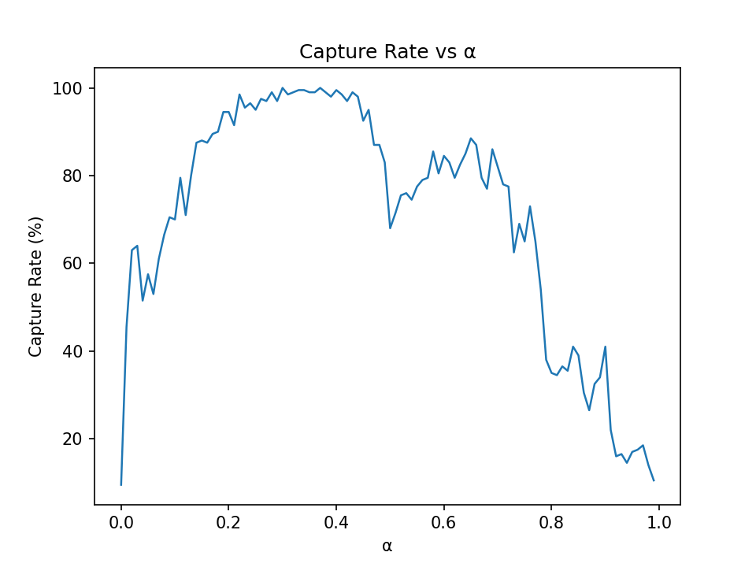
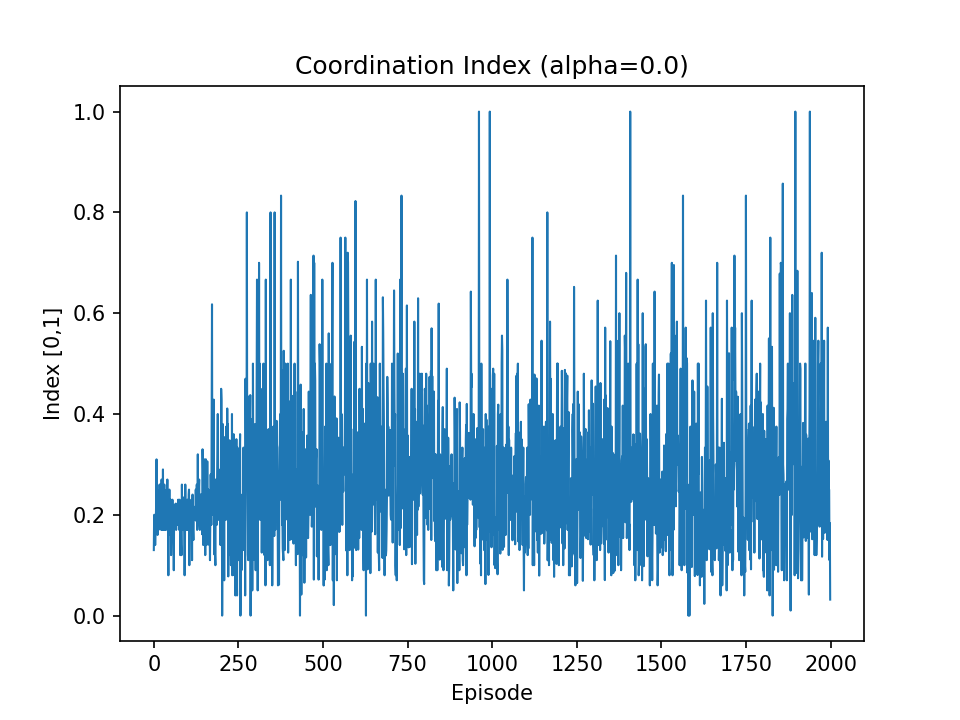
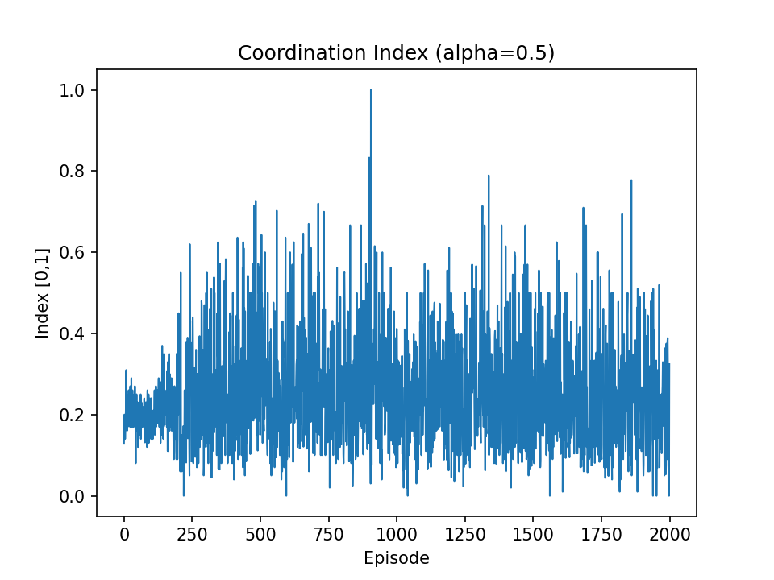
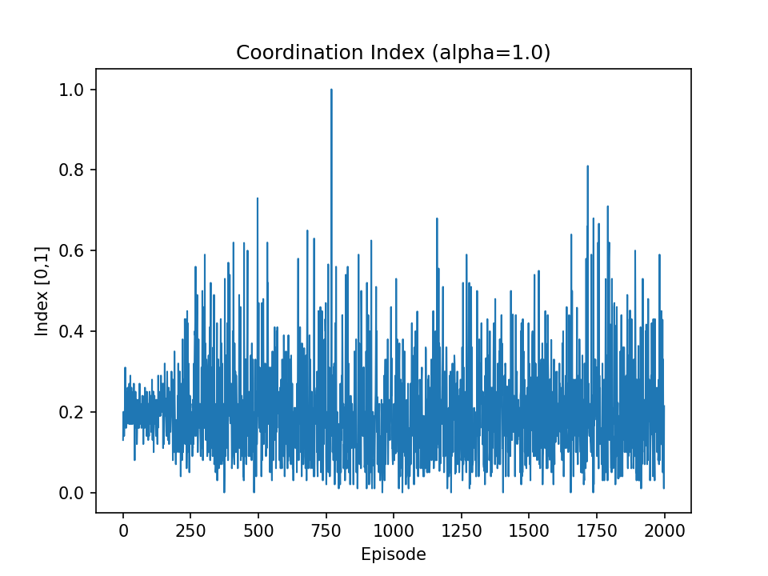

# Emergent Cooperation in Multi-Agent Reinforcement Learning  
### *Effect of Reward Structure on Predator-Prey Coordination*

---

## **Abstract**
This project explores how the balance between individual and shared rewards affects cooperation among agents in a multi-agent reinforcement learning (MARL) setting.  
Using Deep Q-Network (DQN) agents in a predator-prey environment, we varied the reward-mixing coefficient α (0.0–1.0), where α controls how much of each agent’s reward depends on personal versus team success.  
Results show that cooperation emerges most strongly at intermediate values (α ≈ 0.4), where agents balance self-interest with group coordination. This performance drops sharply for α > 0.6, suggesting that excessive individualism harms collective performance.  
These findings highlight how partial cooperation, rather than complete altruism or competition,. yields optimal group behavior in MARL.

---

## **1. Introduction**

In reinforcement learning (RL), an agent learns to make sequential decisions by interacting with an environment to maximize cumulative rewards. When multiple agents coexist, the learning process becomes **multi-agent reinforcement learning (MARL)**.  
In MARL, agents must learn both what actions to take and how to coordinate with others, creating a complex system of cooperation and competition.

One of the most common MARL techniques is called **Deep Q-Network (DQN)**, which combines classical Q-learning with deep neural networks to approximate the Q-function:

$$
Q(s, a) = \mathbb{E}[R_t + \gamma \max_{a'} Q(s', a')]
$$

This function estimates the expected reward \(R_t\) from taking action \(a\) in state \(s\) and following the optimal policy after.  
DQN allows agents to handle large state spaces (like images or gridworlds) by replacing tabular storage with neural network estimators.

However, when multiple agents learn simultaneously, their environments changes and become non-stationary. The state transitions depend not only on the environment but also on the changing policies of other agents.  
Thus, learning stability and coordination depend strongly on how rewards are distributed across agents.

---

## **2. Methods**

### **2.1 Environment**
We implemented a *7×7 predator-prey gridworld* in which:
- Two predator agents (the learners) pursue one prey.  
- The prey moves randomly at each time step.  
- Each predator observes its position, the prey’s location, and environmental boundaries.

Episodes end when:
- The prey is caught (team success, reward = 1), or  
- The step limit (100) is reached (failure, reward = 0).

Each agent can choose from five discrete actions: *up*, *down*, *left*, *right*, or *stay still*.

---

### **2.2 Reward Function and the Role of α**

Each agent’s reward combines its **individual** and **team** success:
$$
R_i = \alpha \cdot r_i + (1 - \alpha) \cdot R_{\text{team}}
$$

| Symbol | Meaning |
|--------|----------|
| \(r_i\) | Individual reward (1 if the agent personally catches the prey, else 0) |
| \(R_{\text{team}}\) | Shared team reward (1 if *either* agent catches the prey) |
| α | Reward balance parameter (0 = fully cooperative, 1 = fully selfish) |

- **α = 0.0:** Each predator only cares about the *team’s* success.  
- **α = 0.5:** Each predator cares equally about its own and team reward.  
- **α = 1.0:** Each predator only cares about *its own* catch.

Thus, α controls how much agents are encouraged to compete versus cooperate.

---

### **2.3 Agent Architecture**
Each predator is a **Deep Q-Network (DQN)** agent:
- Input: the agent’s observation (grid state and prey position).  
- Output: Q-values for each possible action.  
- Learning uses experience replay (a buffer of past transitions) and a target network for stability.

Each agent learns independently from its own experience buffer—known as the **Independent Q-Learning** approach in MARL.  
However, coordination is still possible if reward signals encourage shared goals.

---

### **2.4 Experimental Design**
- **Number of agents:** 2 predators  
- **Grid size:** 7×7  
- **Episodes:** 2000 total  
- **Learning algorithm:** DQN with ε-greedy exploration  
- **Reward structure:** Sweep α from 0.0 to 1.0 in increments of 0.01  
- **Metrics:**
  - *Capture rate*: percentage of episodes where prey was caught  
  - *Coordination index*: similarity between agents’ movement patterns  
  - *Reward variance*: variability between agents’ individual returns  

---

## **3. Results**

### **3.1 Capture Rate vs α**

The capture rate increases rapidly from α = 0.0 to α ≈ 0.4, peaking near 98–100%, then falls sharply beyond α = 0.6.  
Surprisingly, performance did not peak at 0.6 or 0.8 as might be expected if stronger individuality promoted better control.  
Instead, moderate cooperation (α ≈ 0.4) yielded the highest capture rate, showing that agents perform best when partially—but not fully—aligned with the team.  

For α < 0.2, performance is weak since both agents receive identical team rewards, causing a more passive play style.  
At α > 0.6, agents compete for captures, causing interference: one agent may block or chase the prey independently, lowering total team success.

---

### **3.2 Coordination Index (α = 0.0)**

At α = 0.0 (fully cooperative), coordination is inconsistent and remains low (0.2–0.3).  
Both predators receive the same team reward regardless of who actually catches the prey.  
This creates *credit assignment failure*: neither agent knows whether its own movement contributed to success.  
The result is passive and redundant behavior, where agents often move together randomly rather than strategically.

---

### **3.3 Coordination Index (α = 0.5)**

At α = 0.5, coordination improves substantially.  
Agents begin exhibiting complementary behaviors—one predator corners the prey while the other intercepts escape routes.  
Because each agent now receives partial personal feedback, it can distinguish between effective and ineffective behaviors.  
This results in smoother pursuit trajectories and more consistent captures.

---

### **3.4 Coordination Index (α = 1.0)**

At α = 1.0 (fully selfish), coordination collapses.  
Agents pursue independently, often blocking or distracting each other, and overall capture efficiency drops to below 30%.  
Although each agent optimizes its own success, they collectively lose the prey more often: a behavior analogous to competition in social dilemmas.

---

## **4. Discussion**

The α-sweep results reveal a *nonlinear relationship* between reward composition and emergent cooperation:

- **Low α (0–0.2):* Excessive sharing eliminates individual accountability. Agents receive identical feedback regardless of their behavior, slowing learning.  
- *Moderate α (0.3–0.5):* The balance between self-interest and group success drives both learning and coordination. Agents learn meaningful roles and exhibit near-optimal capture rates.  
- *High α (0.6–1.0):* Agents become too competitive, learning policies that prioritize personal gain over team success. The resulting interference reduces global efficiency.

That the performance *peaks at α ≈ 0.4* suggests that even in artificial systems, *slight cooperation bias* promotes stronger collective success.  
This is because team rewards still dominate (60%), aligning agent goals, while individual feedback (40%) preserves the ability to learn specific behaviors.

In short, *a small degree of individuality sustains motivation*, while *shared rewards ensure alignment*: a principle that also appears in biological and economic cooperation models. 
Emergent cooperation arises not from equal reward sharing, but from a careful balance between shared and individual incentives.

---

## **6. Conclusion**

The α-sweep experiment demonstrates that:
- *Fully shared rewards (α = 0)* hinder learning through lack of individual feedback.  
- *Fully individual rewards (α = 1)* promote destructive competition.  
- *Intermediate α (~0.4)* yields the best overall performance, as agents cooperate while maintaining distinct learning signals.

Cooperation in multi-agent systems does not arise from perfect equality or selfishness, but from *partially shared incentives* that reward both teamwork and personal initiative.
This principle applies beyond AI—across social, biological, and economic systems where cooperation depends on balancing self-interest and group success.

---

## **7. Future Work**

Future directions could extend this project by:
1. *Scaling Up Agents:* Testing with 3–4 predators to explore emergent group hierarchies and division of labor.  
2. *Adaptive α Scheduling:* Allowing α to evolve dynamically over training, simulating real-world shifts from cooperation to competition.  
3. *Communication Channels:* Enabling predators to exchange limited signals, studying the emergence of coordination protocols.  
4. *Heterogeneous Agents:* Giving agents different abilities (speed, sensing) to observe how asymmetry affects cooperation.  
5. *Transfer and Generalization:* Training at α = 0.4, then testing at α = 1.0 to evaluate persistence of learned teamwork.  
6. *Reward Shaping Studies:* Introducing additional social rewards or penalties (e.g., energy cost or blocking penalties) to refine cooperative emergence.

---

## **8. References**
- Leibo, J. Z., et al. (2017). *Multi-Agent Reinforcement Learning in Sequential Social Dilemmas.* AAMAS.
- Lowe, R., et al. (2017). *Multi-Agent Actor-Critic for Mixed Cooperative-Competitive Environments.* NeurIPS.  
- Foerster, J., et al. (2018). *Counterfactual Multi-Agent Policy Gradients.* AAAI.  
- Mnih, V., et al. (2015). *Human-level control through deep reinforcement learning.* Nature

---
